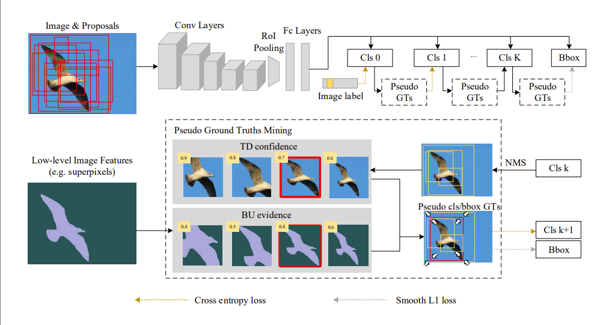

# WSOD^2: Learning Bottom-up and Top-down Objectness Distillation for Weakly-supervised Object Detection
By Zhaoyang Zeng, Bei Liu, Jianlong Fu, Hongyang Chao, and Lei Zhang

### Introduction
This repo is a toolkit for weakly supervised object detection based on [mmdetection](https://github.com/open-mmlab/mmdetection), including the implementation of [WSDDN](https://arxiv.org/abs/1511.02853), [OICR](https://arxiv.org/abs/1704.00138) and [WSOD^2](https://arxiv.org/abs/1909.04972). The implementation is slightly different from the original papers, including but not limited to
* optimizer
* training epoch
* learning rate
* input resolution
* pseudo GTs mining
* loss weight assignment

The baselines in this rpo can easily achieve 48+ mAP on Pascal VOC 2007 dataset. Some hyperparameters are still tuned, they should bring more performance gain.

### Architecture

<p align="left">

</p>

### Results

| Method | VOC2007 test *mAP* | VOC2007 trainval *CorLoc* | VOC2012 test *mAP* | VOC2012 trainval *CorLoc*
|:-------|:-----:|:-------:|:-------:|:-------:|
| WSOD2 | 53.6 | 71.4 | 47.2 | 71.9 | 
| WSOD2\* |  56.0 | 71.4 | 52.7 | 72.2 |

\* denotes training on VOC 07+12 *trainval* splits

### Installation

Please refere to [here](https://github.com/open-mmlab/mmdetection/blob/master/docs/get_started.md) for installation

### Getting Started

1. Download the training, validation and test data, and unzip
```shell
mkdir -p $WSOD_ROOT/data/voc
cd $WSOD_ROOT/data/voc
wget http://host.robots.ox.ac.uk/pascal/VOC/voc2007/VOCtrainval_06-Nov-2007.tar
wget http://host.robots.ox.ac.uk/pascal/VOC/voc2007/VOCtest_06-Nov-2007.tar
tar xf VOCtrainval_06-Nov-2007.tar
tar xf VOCtest_06-Nov-2007.tar
```

2. Download the ImageNet pre-trained models, selective search boxes and superpixels
```shell
bash $WSOD_ROOT/tools/prepare.sh
```

If you can not access google drive, you also can download the resources from [https://pan.baidu.com/s/1htyljhvYz5qwO-4oH8C3wg](https://pan.baidu.com/s/1htyljhvYz5qwO-4oH8C3wg) (password: u5r3) and unzip them, the directory structure should be like
```
data
  - VOCdevkit
    - VOC2007
      - voc_2007_trainval.pkl
      - voc_2007_test.pkl
      - SuperPixels
    - VOC2012
      - voc_2012_trainval.pkl
      - voc_2012_test.pkl
      - SuperPixels
pretrain
  - vgg16.pth
``` 

3. Training a wsod model
```shell
bash tools/dist_train.sh $config $num_gpus
```

4. Evaluate a wsod model
```shell
bash tools/dist_test.sh $config $checkpoint $num_gpus --eval mAP
```

### License
WSOD2 is released under the MIT License.

### Citing WSOD2

If your find this repo useful in your research, please consider citing:

```BibTex
@inproceedings{zeng2019wsod2,
  title={Wsod2: Learning bottom-up and top-down objectness distillation for weakly-supervised object detection},
  author={Zeng, Zhaoyang and Liu, Bei and Fu, Jianlong and Chao, Hongyang and Zhang, Lei},
  booktitle={Proceedings of the IEEE International Conference on Computer Vision},
  pages={8292--8300},
  year={2019}
}
```


